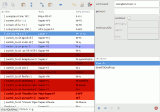

# obkey
ObKey - Openbox Key Editor (PyGObject version)

# About me
After tried almost every window managers,
and having recently left my 'awesomewm' configuration behind a sharp #.

I use OpenBox on my low ressource machine, because it allows to change
windows with direction (north, east, south, west) which is really intuitive way to switch focus.

Another easy to use capability in OpenBox, is the Emacs style multi-levels shorcut.

But, it is really boring to edit OpenBox XML rc file.
After searching in some forums, i found ObKey, which is usefull, but not perfectly usable.
So i forked the project.

# Bugs/Enhancement (Reasons of this fork)
- you can set keybings, save them, close, and re-open the tool and see that it has disappeared
- you cannot organize your keybinding collection with drag and drop

# Changes between obkey 1.1 and obkey 1.2 
- sorted actions in edition pane
- direct preview of relations between actions and keybind

TODO -> button to sort the keybind / drag and drop / alerting users on failure

# About

This fork aims to continue the project since bugs and enhancement stills needed.

Another wish for the future could be the integration :
 - _either_ integration this tool for other window manager (e.g. xmonad)
 - _or_ integration in a setting manager for OpenBox

# About KeyBindings
Key bindings in OpenBox official site :

http://openbox.org/wiki/Help:Bindings

If you want to edit shortcut directly in  command line interface,
see the next project :

https://sourceforge.net/projects/obhotkey/
